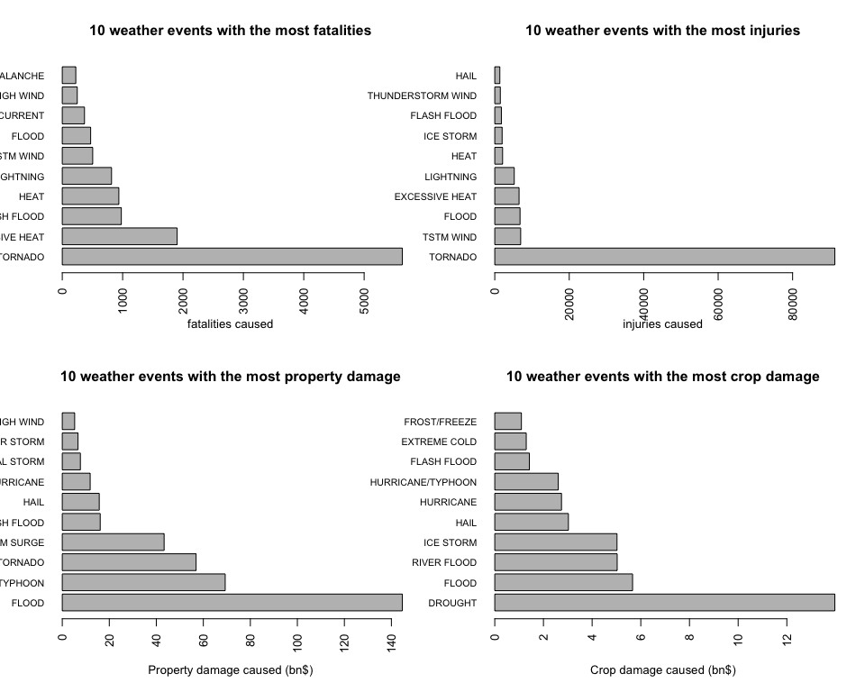
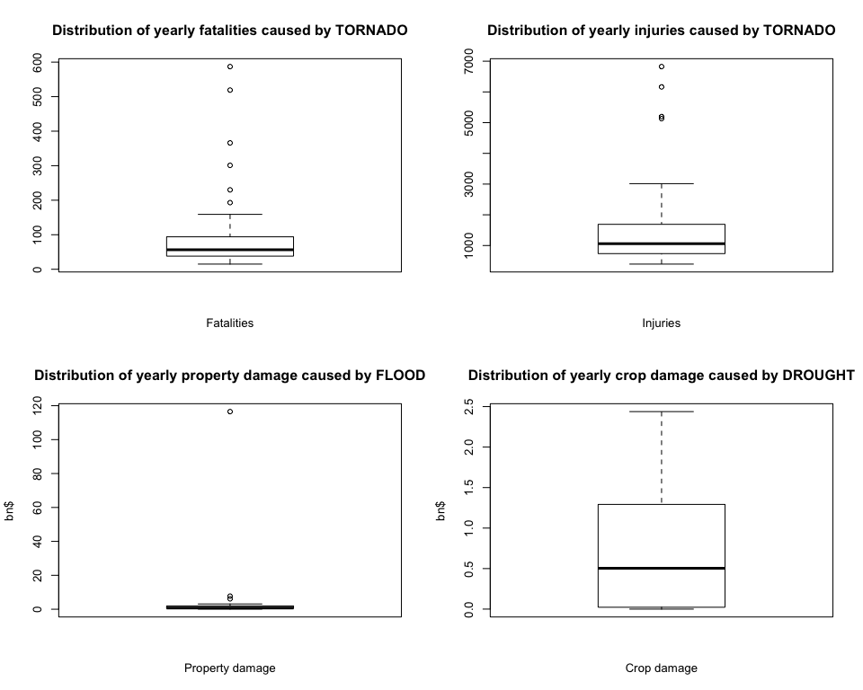

# Historical analysis of the most harmful US weather events
joergandi  
22 Juli 2015  

## Synopsis
Using the U.S. National Oceanic and Atmospheric Administration's (NOAA) storm database, we identify the most harmful weather events in US history between 1950 and 2011. The analysis focuses on the impact of these events on the population in terms of total fatalities and injuries as well as on the economic consquences in terms of total propery and crop damage caused. We find that tornado events are by far the main cause of fatalities and injuries among the US population, while flooding causes by far the most property damage and drought is by far the main reason for crop damage. The analysis of the most harmful weather events over time further shows a significant impact of a few catastrophic outlier events.

## Data Processing
The analysis assumes that the U.S. National Oceanic and Atmospheric Administration's (NOAA) storm database has been downloaded to the local folder. The data is read, date strings are converted and property and crop damage multipliers K,M,B are combined with the damage factors into total damage values. Years of occurrence and damage event types are set as factors.

```r
subdata<-read.csv("repdata-data-StormData.csv.bz2")
subdata<-as.data.frame(subdata)
s2<-transform(subdata,BGN_DATE=as.Date(BGN_DATE,"%m/%d/%Y %H:%H:%S"))
s2$YEAR<-as.factor(as.numeric(format(s2$BGN_DATE,"%Y")))
expconv<-function(x) {
  if (x=="K") {x=1000}
  else if (x=="M") {x=10^6}
  else if (x=="B") {x=10^9}
  else {x=1}
  return(x)
}
s2$PROPDMGEXP<-lapply(s2$PROPDMGEXP,expconv)
s2$PROPDMGTOTAL<-as.numeric(s2$PROPDMG) * as.numeric(s2$PROPDMGEXP)
s2$CROPDMGEXP<-lapply(s2$CROPDMGEXP,expconv)
s2$CROPDMGTOTAL<-as.numeric(s2$CROPDMG) * as.numeric(s2$CROPDMGEXP)
s2<-transform(s2,EVTYPE=as.factor(EVTYPE))
top_n_events<-10
```

We choose to evaluate the 10 most harmful events for each of the four impact categories. We sum the total damage per event type and category, ignoring NAs, and sort the events by their total damage. For convenience, the property and crop damage values are given in billions of US Dollars.


```r
propdmg_by_event<-tapply(s2$PROPDMGTOTAL,s2$EVTYPE,sum,na.rm=TRUE)
propdmg_by_event_top<-head(sort(propdmg_by_event,decreasing = TRUE, na.last = NA),
                           top_n_events)
propdmg_by_event_top<-propdmg_by_event_top/10^9
cropdmg_by_event<-tapply(s2$CROPDMGTOTAL,s2$EVTYPE,sum,na.rm=TRUE)
cropdmg_by_event_top<-head(sort(cropdmg_by_event,decreasing = TRUE, na.last = NA),
                           top_n_events)
cropdmg_by_event_top<-cropdmg_by_event_top/10^9
inj_by_event<-tapply(s2$INJURIES,s2$EVTYPE,sum)
inj_by_event_top<-head(sort(inj_by_event,decreasing = TRUE, na.last = NA),
                       top_n_events)
fat_by_event<-tapply(s2$FATALITIES,s2$EVTYPE,sum)
fat_by_event_top<-head(sort(fat_by_event,decreasing = TRUE, na.last = NA),
                       top_n_events)
```

In addition, we sum the damage per event and category for each year, again ignoring NAs (e.g. years without records), to be able to assess mean and variance of the damage over time. 


```r
cropdmg_by_event2<-tapply(s2$CROPDMGTOTAL,list(s2$EVTYPE,s2$YEAR),sum,na.rm=TRUE)
propdmg_by_event2<-tapply(s2$PROPDMGTOTAL,list(s2$EVTYPE,s2$YEAR),sum,na.rm=TRUE)
inj_by_event2<-tapply(s2$INJURIES,list(s2$EVTYPE,s2$YEAR),sum,na.rm=TRUE)
fat_by_event2<-tapply(s2$FATALITIES,list(s2$EVTYPE,s2$YEAR),sum,na.rm=TRUE)
cropdmg_by_event2<-cropdmg_by_event2/10^9
propdmg_by_event2<-propdmg_by_event2/10^9
loss_over_time<-data.frame(
  pd=propdmg_by_event2[names(propdmg_by_event_top)[1],],
  cd=cropdmg_by_event2[names(cropdmg_by_event_top)[1],],
  i=inj_by_event2[names(inj_by_event_top)[1],],
  f=fat_by_event2[names(fat_by_event_top)[1],])
```

## Results

The first analysis shows the damage caused per category by the 10 most harmful events. Tornado events are by far the main cause of fatalities and injuries among the US population, flooding causes by far the most property damage, and drought is by far the main reason for crop damage. It is particularly remarkable that by an order of magnitude, Tornado events cause more injuries than any other weather event, while excessive heat is the second most harmful weather event in terms of fatalities.


```r
par(mfrow = c(2, 2)) 
par(las=2) 
barplot(fat_by_event_top,horiz = TRUE, cex.names=0.8, xlab="fatalities caused",
        main=paste(as.character(top_n_events),"weather events with the most fatalities"));

barplot(inj_by_event_top,horiz = TRUE, cex.names=0.8, xlab="injuries caused",
        main=paste(as.character(top_n_events),"weather events with the most injuries"));

barplot(propdmg_by_event_top,horiz = TRUE, cex.names=0.8, xlab="Property damage caused (bn$)",
        main=paste(as.character(top_n_events),"weather events with the most property damage"));

barplot(cropdmg_by_event_top,horiz = TRUE, cex.names=0.8, xlab="Crop damage caused (bn$)",
        main=paste(as.character(top_n_events),"weather events with the most crop damage"));
```

 

For the most harmful weather event per category, we analyse the distribution of the damage over the years. It appears that a few catastrophic outlier tornado events have a significant impact on the fatalities and the injuries; a single flood event in 2006 has been responsible for a significant part of the total property damage. Crop damage by drought seems more stable over time.


```r
par(mfrow = c(2, 2)) 
boxplot(loss_over_time$f,xlab="Fatalities",
        main=paste("Distribution of yearly fatalities caused by",
                   names(fat_by_event_top)[1]))
boxplot(loss_over_time$i,xlab="Injuries",
        main=paste("Distribution of yearly injuries caused by",
                   names(inj_by_event_top)[1]))
boxplot(loss_over_time$pd,xlab="Property damage",ylab="bn$",
        main=paste("Distribution of yearly property damage caused by",
                   names(propdmg_by_event_top)[1]))
boxplot(loss_over_time$cd,xlab="Crop damage",ylab="bn$",
        main=paste("Distribution of yearly crop damage caused by",
                   names(cropdmg_by_event_top)[1]))
```

 


